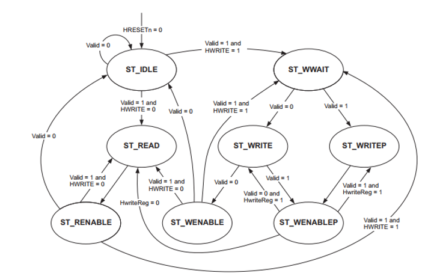
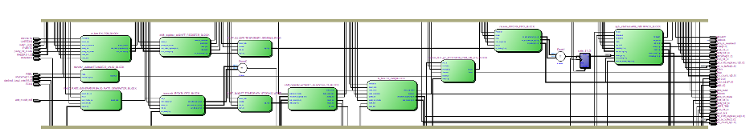
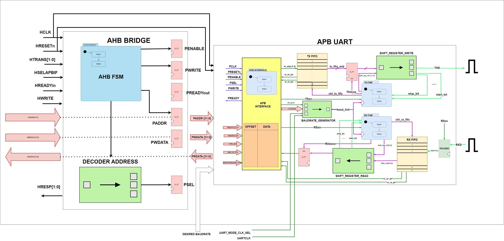
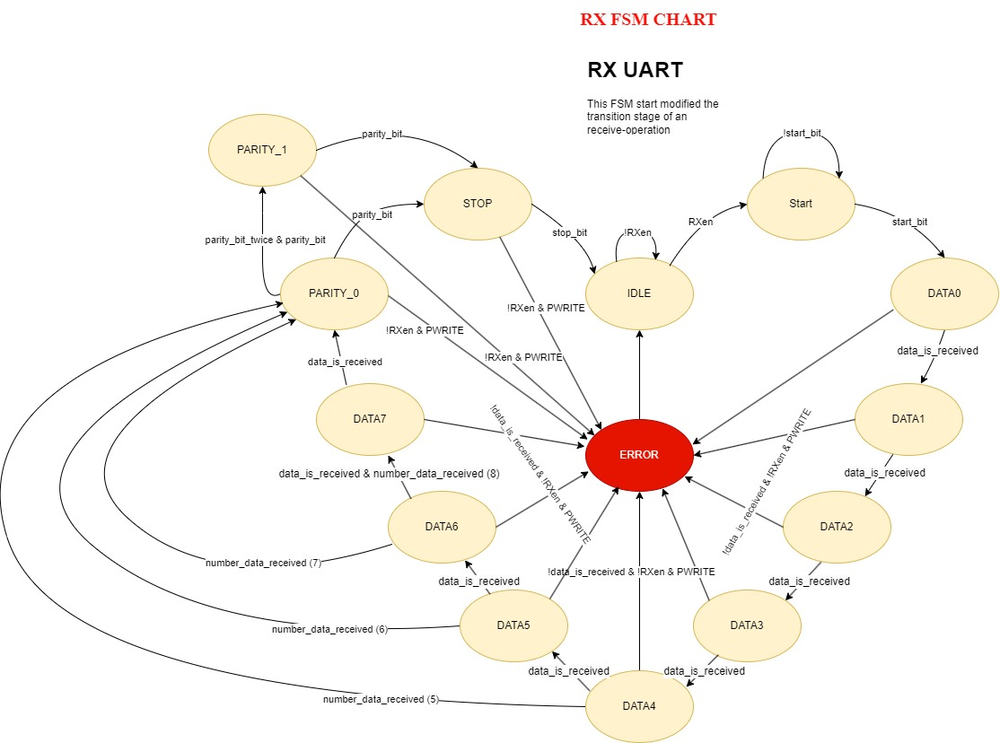
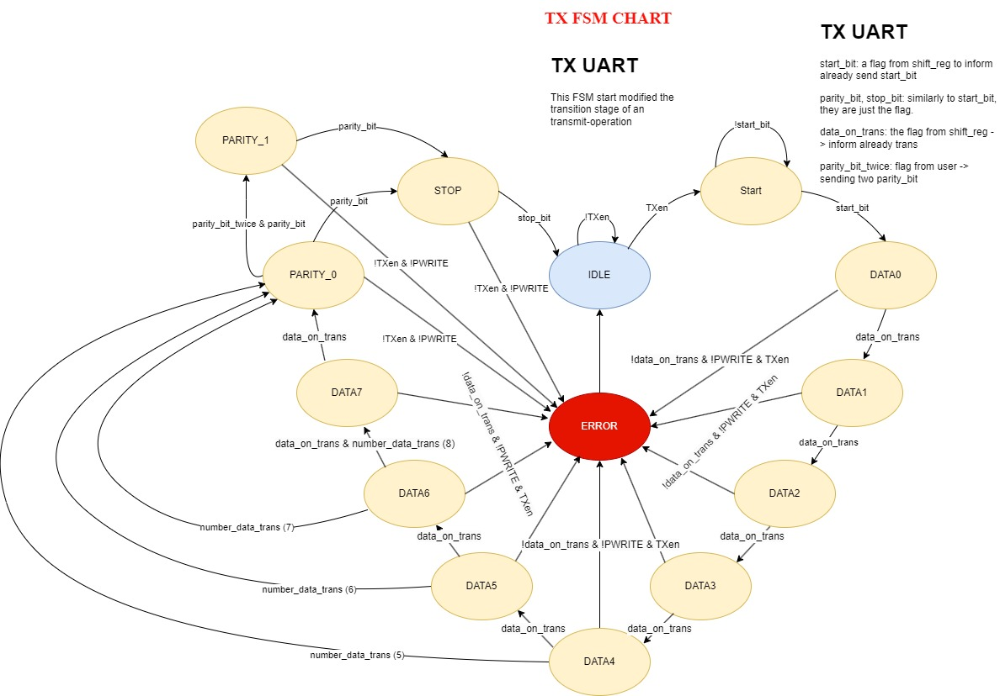
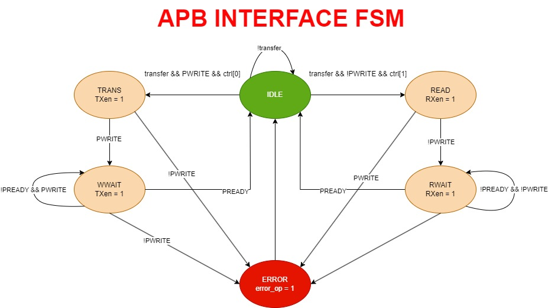

# Feature: Implement an AMBA AHB - APB UART communication integrated with High Bandwidth On-chip Memory on RISC-V 32 bits Processor (application for FPGA kit DE10)
+ 13.08.2024 | Personal | Testing Version
+ 11.09.2024 | Personal | Testbench

## 1. Introduction
UPDATE 13 August 2024: you are invited to test the main branch, which is the result of my experiment about AHB - APB with APB UART. I haven't completed testing this feature yet but I expect it would work. If you do test it, please let me know and I'll adjust and merge it to master.

NOTE: I did a custom version of this system for my capstone project (graduation). Basic testing shows it works correctly but please let me know if you encounter any issues.

## 2. Tool use
+ Quartus II 64-bit for Compiler
+ Modelsim for Simulator
+ Ubuntu 22.04 (Later)

## 3. Design Architecture & Signal used

### UART Configuration
|          Signal                |bit-num |  type (I/O) | 
|--------------------------------|--------|-------------|
| PSELx     (UART)               |   1    |    INPUT    | 
| PENABLE   (UART)               |   1    |    INPUT    | 
| RXD  (UART)                    |   1    |    OUTPUT   |  (Serial) 
| TXD  (UART)                    |   1    |    INPUT    |  (Serial) 
| PADDR                          |   32   |    INPUT    |           -> Custom based on reference: https://developer.arm.com/documentation/ddi0479/latest/
| PWDATA                         |   16   |    INPUT    |
| PRDATA                         |   16   |    INPUT    |           
| TXD  (UART)                    |   1    |    INPUT    |  (Serial) 
| Baudrate (baud_rate_desired)   |   20   |    INPUT    |           -> Can be down to 16 (depend on dev)
| Start Bit                      |   1    |    IN/OUT   |
| Data Length (including Parity) |   9    |    IN/OUT   |  (Serial) -> This is the first basic design for testing whether the project is working or not
| Parity                         |   1    |    IN/OUT   |           -> Can be ignore if not used (not for this version)
| Stop Bit                       |   1    |    IN/OUT   |

### AHB - APB Bridge    (This operation based on FSM of APB Bridge )
|          Signal                |bit-num |  type (I/O) | 
|--------------------------------|--------|-------------|
| UARTCLK                        |   1    |    INPUT    |           -> Custom signal for UART sel mode
| HCLK                           |   1    |    INPUT    |           -> Rising Edge Operation                (50 MHz for current testing)
| HPRESETn                       |   1    |    INPUT    |           -> Active Low
| HADDR                          |   32   |    INPUT    |           -> This signal is typically used for selecting peripheral to send request to
| HWRITE                         |   1    |    INPUT    |           -> Indicate Write or Read only
| HSELx                          |   1    |    INPUT    |           -> x can be your own number (incase integrated other peripheral (MEM,..))
| HRDATA                         |   32   |    INPUT    |           -> This is the first basic design for testing whether the project is working or not
| HWDATA                         |   32   |    INPUT    |           -> Can be ignore if not used (not for this version)
| HTRANS                         |   2    |    INPUT    |           -> Further use
| HREADYin                       |   1    |    INPUT    |           -> Further use
|                                |        |             |
| HREADYout                      |   1    |    OUTPUT   |           -> Further use
| PCLK                           |   1    |    OUTPUT   |
| PPRESETn                       |   1    |    OUTPUT   |
| PRDATA                         |   32   |    OUTPUT   |           -> Not full tested  (16 bits tested only)
| PWDATA                         |   32   |    OUTPUT   |           -> Not full tested  (16 bits tested only)
| PADDR                          |   32   |    OUTPUT   |
| PSELx                          |   1    |    OUTPUT   |           -> x can be your own number (incase integrated other peripheral (TIMER, SPI, I2C,...))
| PENABLE                        |   1    |    OUTPUT   | 

<!--  -->
### APB Interface (for register block only)
https://developer.arm.com/documentation/ddi0479/latest/ page 4-9 (APB components)

## 4. Sample of Design
### 4.1. RTL design of APB UART
 
### 4.2. RTL design of AHB - APB to APB UART

### 4.3. RX FSM
                  <!-- on fixing --> 
### 4.4. TX FSM

### 4.5. APB INTERFACE FSM

## 5. Authors and acknowledgment
Github: https://github.com/hungpio89

## 6. Project status
Unfinished -> Finished with simulation on Modelsim -> 

### Please show your appreciation to those who have contributed to the project.
